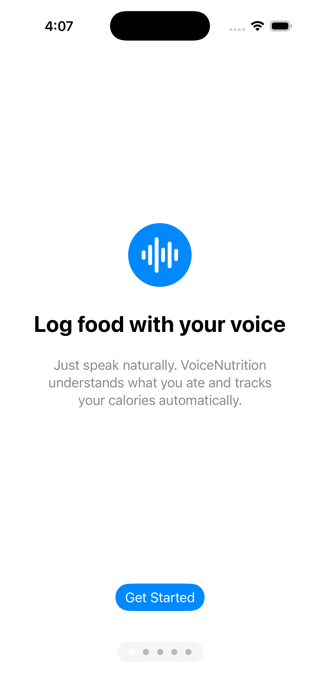
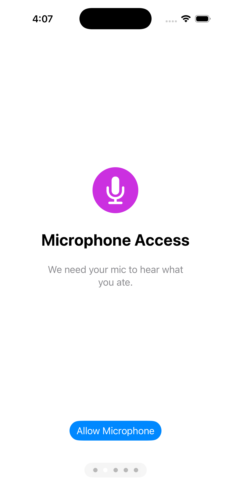
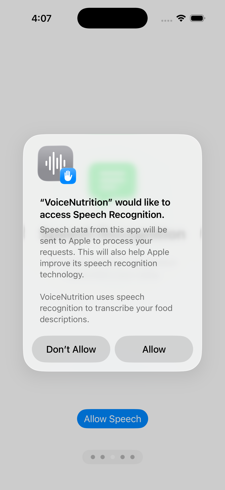
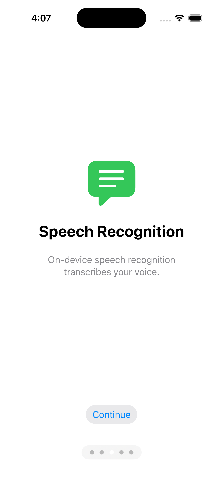
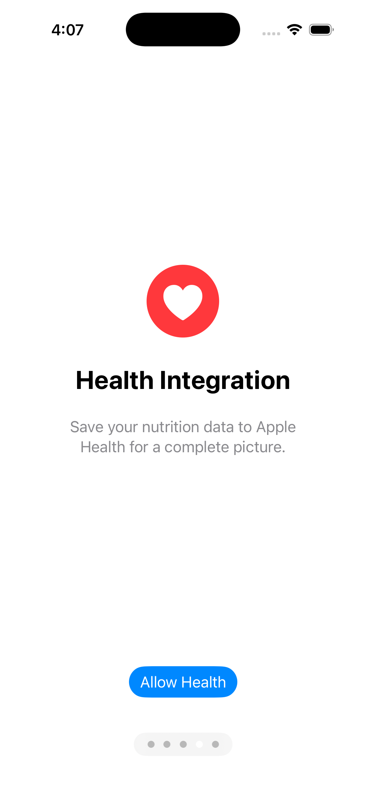
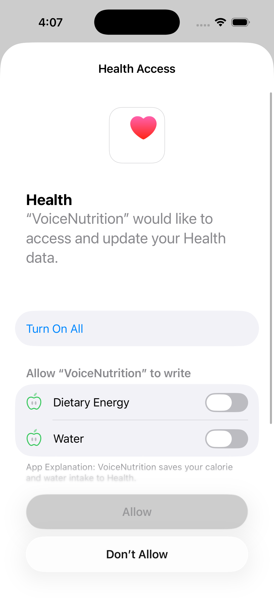
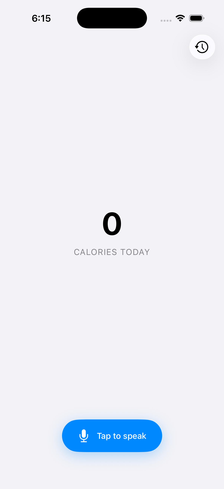
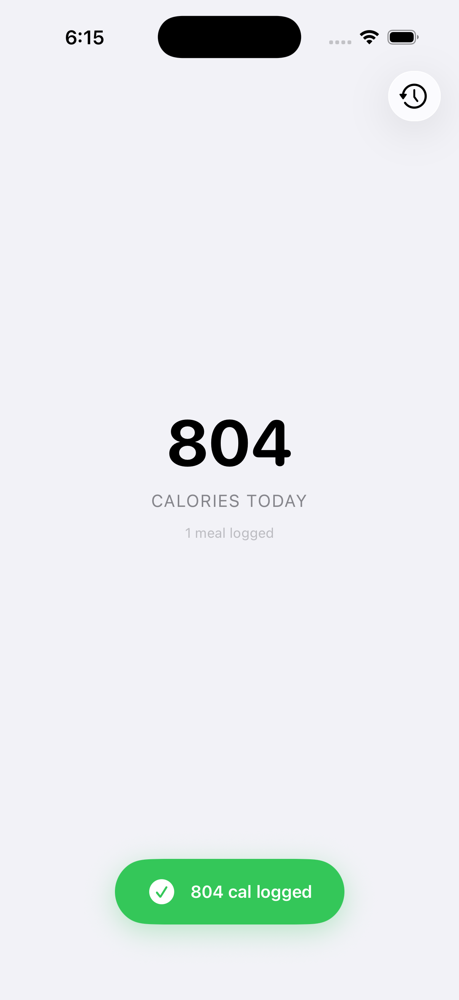
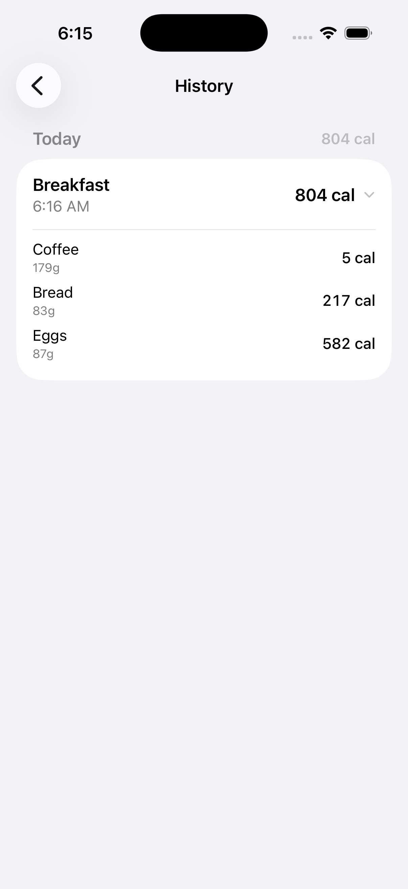

# VoiceNutrition

Voice-powered calorie logging for iOS. 100% on-device using Apple Foundation Models, SFSpeechRecognizer, and NLEmbedding. Zero network dependency.

## Screenshots

| Onboarding | Microphone | Speech Permission | Speech Recognition | Health Integration |
|:---:|:---:|:---:|:---:|:---:|
|  |  |  |  |  |

| HealthKit Access | Main Screen | Meal Logged | History |
|:---:|:---:|:---:|:---:|
|  |  |  |  |

## How It Works

```
Hold → Speak → Release → Done

Mic ──→ SFSpeechRecognizer ──→ Apple Foundation Models (@Generable) ──→ NutritionLog
         (on-device STT)          (structured extraction)

NutritionLog ──→ FoodDatabase (NLEmbedding fuzzy match) ──→ PortionResolver ──→ ConfidenceScorer
                   (~800 USDA foods, bundled JSON)            (4-level fallback)   (hybrid model)

──→ DateResolver ──→ Review Gate ──→ SwiftData + HealthKit ──→ ✅
     (3-level)       (single sheet      (local first,
                      or skip)           HK second)
```

The user holds a button and says something like *"I had a large bowl of oatmeal and a banana for breakfast."* The app transcribes on-device, extracts structured food data via Apple Foundation Models, fuzzy-matches against a bundled USDA database, resolves portions and calories, and saves — all without touching the network.

## Architecture

**Clean Architecture + MVVM + AppCoordinator.** Protocol-based DI, no third-party containers.

| Layer | Responsibility | Imports |
|---|---|---|
| Domain | Protocols, Use Cases, Models, Resolvers | Pure Swift only |
| Data | Repository implementations | FoundationModels, Speech, HealthKit, SwiftData, NaturalLanguage |
| Presentation | Views + ViewModels + State Machine | SwiftUI only |
| Navigation | AppCoordinator, routing, availability | SwiftUI, FoundationModels |
| Composition Root | DependencyContainer + @main | Everything — only place concrete types exist |

**Documented exceptions:** `NutritionLog` uses `@Generable` and `NutritionSession`/`FoodEntry` use `@Model` in the Domain layer. These macros require declaration-site application. In production, these would be DTOs in Data with mappers. For this scope, readability was prioritized over strict purity.

## Key Design Decisions

### Push-to-Talk (aligned with Wispr Flow)
The app uses hold-to-speak, release-to-stop — the same interaction model Wispr Flow uses. This gives the user explicit control and eliminates silence detection heuristics. The speech protocol is split into `startTranscription()` (on press) and `stopAndFinalize() async throws -> String` (on release), which avoids the `withCheckedThrowingContinuation` double-resume crash that a single `transcribe()` method would risk.

### Hybrid Confidence Model
Confidence is two independent signals combined: the **LLM's semantic assessment** (did the user speak clearly?) and **structural assessment from code** (did the data pipeline resolve cleanly?). The LLM evaluates language — the code evaluates data. This separation means the model never judges nutritional accuracy, and the code never judges linguistic ambiguity.

### Single Combined Review Sheet
When the system needs user input (ambiguous date, low confidence items, unresolved foods), everything is batched into **one sheet**. Never two sequential prompts. The sheet has toggles only — no inline editing. If the system got it wrong, the user cancels and re-speaks (5 seconds). This is consistent with the voice-first philosophy: speak it right rather than fix it after.

### Honest Uncertainty
The system never silently invents data. Portion sizes follow a 4-level fallback (explicit grams → JSON default → category default → ask user). Date resolution is 3-level (exact → approximated with pre-fill → unknown with empty picker). When both fail, the item goes to review. Partial calorie totals (3 of 4 items resolved) are shown with a flag rather than blocking the entire session.

### Three Model Unavailability States
Apple's Foundation Models API surfaces three distinct reasons: `deviceNotEligible`, `appleIntelligenceNotEnabled`, and `modelNotReady` (still downloading). Each gets a specific user message and recovery path. Missing `modelNotReady` — the most common transient state — would show a generic error to users who just enabled Apple Intelligence.

## Tech Stack

- **iOS 26+**, Swift 6, SwiftUI
- **Apple Foundation Models** — on-device LLM with `@Generable` for structured extraction
- **SFSpeechRecognizer** — on-device speech-to-text (`requiresOnDeviceRecognition = true`)
- **NLEmbedding** — word embeddings for fuzzy food name matching (cosine similarity)
- **SwiftData** — local persistence with `@Model`, CloudKit-ready architecture
- **HealthKit** — write-only (dietaryEnergyConsumed + dietaryWater), aggregate per session

## Edge Cases Handled

- **Push-to-talk lifecycle** — split start/stop protocol prevents continuation double-resume crash
- **`@AppStorage` + `@Observable`** — incompatible; coordinator uses UserDefaults directly
- **`healthKitSynced` flag** — prevents duplicate HealthKit writes on retry, restart, or future CloudKit sync. Mutated on `@MainActor` only (SwiftData concurrency safety)
- **Date check scope** — evaluates ALL items' temporal references, not just the first. Catches ambiguity anywhere in the session
- **Database load failure** — treated as fatal, caught at init. Never silently swallowed
- **NLEmbedding nil** — graceful fallback when word embeddings unavailable on device
- **`fullyUnavailable` state** — dedicated compound state when both speech AND model are down (text fallback requires the LLM, so it's not an option either)

## What I Would Do With More Time

- **DTO/Mapper separation** — move `@Generable` and `@Model` types to Data layer with pure Domain models
- **`@Guide` macros** — add per-property hints to `NutritionLog.FoodItem` for better LLM extraction
- **User food dictionary** — let users add foods not in the USDA database
- **Multilingual support** — Spanish, Portuguese. Requires locale-aware SFSpeechRecognizer + FM prompt tuning
- **Streaming generation** — show partial results via `@Generable` `PartiallyGenerated` snapshots
- **CloudKit sync** — architecture is ready (unique UUIDs, cascade deletes, no blobs, dedup flag)
- **Conflict resolution** — `@Attribute(.unique)` behaves differently under CloudKit merge

## Requirements

- Xcode 26+
- iOS 26+ device with Apple Intelligence enabled
- iPhone 15 Pro or later (Apple Intelligence hardware requirement)
